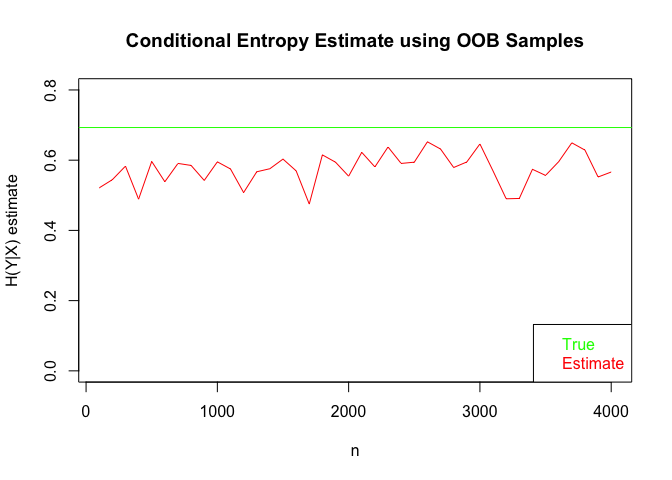

Using OOB to prevent overfitting in rf-Conditional Entropy Estimate
================

Let’s first try to import lumberjack

``` r
library(rerf)
```

    ## Warning: package 'rerf' was built under R version 3.4.4

Cool\! Easy to load. We will quickly run through the tutorial just to
catch ourselves up with R and how LJ works.

``` r
X <- as.matrix(iris[,1:4])
Y <- iris[[5L]]
forest <- RerF(X, Y, seed = 1L, num.cores = 1L)
forest$trees[[1]]
```

    ## $treeMap
    ##  [1]  1  2 -8 -1  3  4  5 -2 -3 -4  6 -5  7 -6 -7
    ## 
    ## $CutPoint
    ## [1] -0.70 -7.05  1.90  1.70  1.35  0.75  1.75
    ## 
    ## $ClassProb
    ##      [,1] [,2] [,3]
    ## [1,]    0    0    1
    ## [2,]    0    1    0
    ## [3,]    0    0    1
    ## [4,]    0    0    1
    ## [5,]    0    1    0
    ## [6,]    0    1    0
    ## [7,]    0    0    1
    ## [8,]    1    0    0
    ## 
    ## $matAstore
    ##  [1]  4 -1  1 -1  2 -1  3  1  4  1  1  1  3 -1  2  1  4 -1  4  1
    ## 
    ## $matAindex
    ## [1]  0  2  4  8 10 14 18 20
    ## 
    ## $ind
    ## NULL
    ## 
    ## $rotmat
    ## NULL
    ## 
    ## $rotdims
    ## NULL
    ## 
    ## $delta.impurity
    ## NULL

``` r
?Predict
```

``` r
trainIdx <- c(1:40, 51:90, 101:140)
forest <- RerF(X[trainIdx, ], Y[trainIdx], seed = 1L, num.cores = 1L)
predictions = Predict(X[-trainIdx,], forest, aggregate.output = TRUE, output.scores = TRUE)
predictions
```

    ##        [,1]  [,2]  [,3]
    ##  [1,] 1.000 0.000 0.000
    ##  [2,] 0.898 0.092 0.010
    ##  [3,] 1.000 0.000 0.000
    ##  [4,] 0.992 0.008 0.000
    ##  [5,] 0.978 0.022 0.000
    ##  [6,] 1.000 0.000 0.000
    ##  [7,] 0.996 0.004 0.000
    ##  [8,] 1.000 0.000 0.000
    ##  [9,] 0.998 0.002 0.000
    ## [10,] 0.996 0.004 0.000
    ## [11,] 0.000 0.960 0.040
    ## [12,] 0.000 0.978 0.022
    ## [13,] 0.000 0.998 0.002
    ## [14,] 0.038 0.938 0.024
    ## [15,] 0.000 0.986 0.014
    ## [16,] 0.002 0.990 0.008
    ## [17,] 0.000 0.994 0.006
    ## [18,] 0.000 0.992 0.008
    ## [19,] 0.090 0.892 0.018
    ## [20,] 0.000 0.992 0.008
    ## [21,] 0.000 0.014 0.986
    ## [22,] 0.000 0.124 0.876
    ## [23,] 0.000 0.064 0.936
    ## [24,] 0.000 0.008 0.992
    ## [25,] 0.000 0.010 0.990
    ## [26,] 0.000 0.054 0.946
    ## [27,] 0.000 0.130 0.870
    ## [28,] 0.000 0.018 0.982
    ## [29,] 0.004 0.048 0.948
    ## [30,] 0.002 0.176 0.822

This is very good\! What is outputted above is exactly what we want, the
posterior distribution given for each X. Now all that’s left to do is to
translate our scenario from the jupyter notebooks to R\!

From our previous simulation, we want \(Y \sim Bernoulli(1/2)\) be -1 or
1 and \(X \sim \mathcal N(\mu y, 1)\).

``` r
getSample <- function(n, mu) {
  y = rbinom(n, 1, .5)
  X = rep(0, n)
  for (i in 1:n) {
    if (y[i] == 1) {
      X[i] <- rnorm(1, mu, 1)
    } else {
      X[i] <- rnorm(1, -mu, 1)
    }
  }
  return(data.frame(X, y))
}

data <- getSample(1000, 0)
```

Cool, we have data. Now let’s reconstruct the algorithm\!

``` r
?Predict
estConditionalEntropy <- function(X, y) {
  forest <- RerF(X, as.matrix(y), trees = 500, store.oob = TRUE, bagging = .368, replacement = FALSE)
  predictions = OOBPredict(X, forest, output.scores = TRUE)
  entropies <- apply(predictions, 1, function(x){
    entropy <- 0
    for (i in x) {
      entropy <- entropy - i*log(i)
    }
    return(entropy)
  })
  entropies[is.nan(entropies)] <- 0
  return(mean(entropies))
}
predictions <- estConditionalEntropy(data[1], data[2])
predictions
```

    ## [1] 0.6130115

This seems similar to the results from python which isn’t good. Let’s
reproduce the plot.

``` r
n_vec <- seq(100, 4000, 100)
mean <- 0
entr_vec <- rep(0, 40)
for (i in 1:40) {
  data <- getSample(n_vec[i], mean)
  entr_vec[i] <- estConditionalEntropy(data[1], data[2])
  print("done")
}
```

    ## [1] "done"
    ## [1] "done"
    ## [1] "done"
    ## [1] "done"
    ## [1] "done"
    ## [1] "done"
    ## [1] "done"
    ## [1] "done"
    ## [1] "done"
    ## [1] "done"
    ## [1] "done"
    ## [1] "done"
    ## [1] "done"
    ## [1] "done"
    ## [1] "done"
    ## [1] "done"
    ## [1] "done"
    ## [1] "done"
    ## [1] "done"
    ## [1] "done"
    ## [1] "done"
    ## [1] "done"
    ## [1] "done"
    ## [1] "done"
    ## [1] "done"
    ## [1] "done"
    ## [1] "done"
    ## [1] "done"
    ## [1] "done"
    ## [1] "done"
    ## [1] "done"
    ## [1] "done"
    ## [1] "done"
    ## [1] "done"
    ## [1] "done"
    ## [1] "done"
    ## [1] "done"
    ## [1] "done"
    ## [1] "done"
    ## [1] "done"

``` r
n <- n_vec
conditional_entropy_estimate <- entr_vec
plot(n, conditional_entropy_estimate, type="l",col="red", ylim = c(0, .8), ylab = "H(Y|X) estimate", main = "Conditional Entropy Estimate using OOB Samples")
abline(h = .693, col="green")
legend("bottomright", legend = c("True", "Estimate"), text.col = c("green", "red"))
```

<!-- -->
